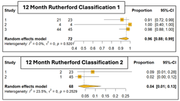
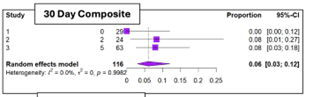

```{css, echo=FALSE}

.logo-left img {
  height: 50px;
  width: auto;
  display: block;
}

div.poster_title{
  width: 80%;
  text-align: center;
}

.section h4 {
  break-after: column;
}

div.footnotes {
  font-size: 18pt;
}

img.stent_banner{
  max-width: 100%;
  width: 100%;
  height: auto;
  opacity: 0.85;
  margin: 8mm 0 6mm 0;
  display: block;
}

img.margin-jinn-logo{
  display: block;
  width: 50%;
  max-width: 50%;
  height: auto;
  margin: 10mm auto 0 auto;
  opacity: 0.95;
}


```

<!-- Don't change anything above, except the title and author names, unless you know what you are doing. -->

<!-- I chose green for primary colour because maroon was the default so some people might stay with it, and then the next most obvious colour is blue as it's very techy/ mathematical so I expect to see a lot of blue posters. To stand out I chose green, it's also very pleasant for the eye. Let me know what you think -->


```{r, include=FALSE}
knitr::opts_chunk$set(echo = FALSE,
                      warning = FALSE,
                      tidy = FALSE,
                      message = FALSE,
                      fig.align = 'center',
                      out.width = "100%")
options(knitr.table.format = "html") 
# Load any additional libraries here
library(tidyverse)
library(plotly)
library(kableExtra)
```


# Background
Non-Inferiority (NI) trials are becoming increasingly relevant in clinical research (have ref.). Yet, NI trials are frequently poorly designed and interpreted. Confusion arises around NI margins, active control selection, and statistical conclusions. This leads to detrimental consequences on the manufacturers, clinicians, and the wider public.

## What is a Non-Inferiority Trial?
- **Non-Inferiority Trials:** Clinical studies designed to demonstrate a new treatment is not clinically worse than an active control by more than a pre-specified margin (FDA).

- **Non-Inferiority Margin (Δ):** Pre-specified & approved threshold the new treatment must meet to prove it preserves a clinically meaningful portion of the active control's effect (2).

- NI Trials typically run like a randomised control trial but comparing the new treatment with an **active control-** an established standard of care used, instead of a placebo.

- Non-inferiority must show the new treatment’s estimated effect, along with its confidence interval, lies within the pre-specified non-inferiority margin.

## Aims & Objectives
1. To define and justify Δ for the case study using historical and published evidence.
2. To develop statistically appropriate NI trial design parameters from a bio statistical perspective.
3. Develop a Shiny app to determine and visualize different sample size requirements under varying design assumptions and inferiority margins.
4. To analyse and interpret simulated trial data and evaluate NI conclusions.
5. To critically reflect on the limitations and assumptions inherent to NI designs.


<!-- You can change where you put these breaks, and the "column_numbers: 4" argument in the YAMLS header to change the layout of the poster, with care! -->
<!-- This #### above causes the columns to break -->
<!-- this might be a very long section, so maybe full column is needed? -->

# Case-study: Biomimics 3D stent
It is 2008 and we have just been hired as statisticians for BioMimics 3D Vascular Stent’s pivotal NI trial:


The BioMimics 3D stent is a peripheral vascular stent implanted in the leg or arm to improve blood flow in patients with peripheral vascular disease (narrowing of the peripheral blood vessels). Unlike conventional straight stents, it features a three-dimensional helical design, intended to improve vascular performance and blood flow in affected vessels.

Our research project involves meeting with Kevin Heraty, BioMimic’s lead scientist, to design & interpret this NI trial from a statistician’s perspective.
This includes:

- Defining and justifying the safety & efficacy endpoint.

- Ensuring a statistically powered and ethical trial.

- Deciding on valid analysis methods.

- Correctly interpreting and communicating the results.


# Meta-Analysis & Evidence base

<h3>Evidence-Based Safety Performance Goals (30 Days)</h3>



<h3>Evidence-Based Efficacy Performance Goals (12 Months)</h3>



To determine appropriate safety and efficiency endpoints for The Biomimics Pivotal study we conducted a targeted literature review of clinical trials previously run involving peripheral vascular devices (referenced below). This included a meta-analysis which we analysed & utilized at an individual participant data (IPD) level to justify our chosen endpoints.


# Margin-Jinn
Margin-Jinn is an interactive Shiny application we developed as a part of our project to support statistical planning for NI trials.The app allows users to explore how sample size requirements change under different design assumptions, including the choice of confidence-interval method, highlighting how these decisions can influence NI conclusions.

In this study, Margin-Jinn is applied to the BioMimics 3D case study to justify and critically assess sample size decisions under realistic design scenarios.

 WIP LOGO

GitHub:
https://github.com/FilipMKgit/Margin-Jinn

# Next Steps

- Extend the BioMimics 3D case-study through simulation of non-inferiority trial data.
- Analyse simulated trial outcomes to assess NI conclusions.
- Further explore the assumptions, limitations, and interpretational caveats inherent to NI trials.


# References

TEXT TEXT TEXT