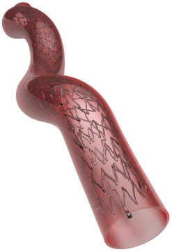
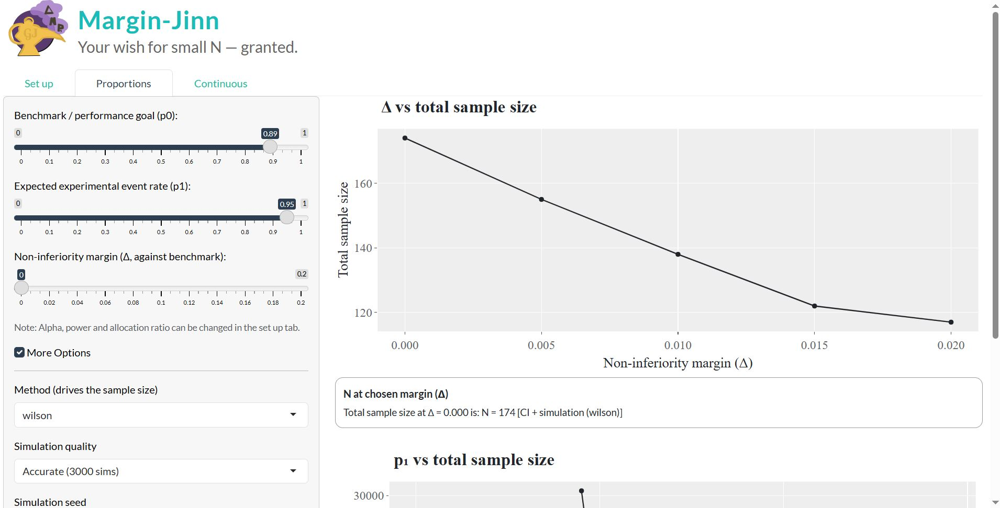

<style>

ul, ol {
  margin-top: 0 
  margin-bottom: 0 
}


li {
  line-height: 1.1;
  margin-bottom: 0.1em;
}

li p {
  margin: 0 !important;
}
</style>


```{css, echo=FALSE}


.logo-left img {
  height: 50px;
  width: auto;
  display: block;
}

div.poster_title{
  width: 80%;
  text-align: center;
}

.section h4 {
  break-after: column;
}

div.footnotes {
  font-size: 18pt;
}


```

<!-- Don't change anything above, except the title and author names, unless you know what you are doing. -->

<!-- I chose green for primary colour because maroon was the default so some people might stay with it, and then the next most obvious colour is blue as it's very techy/ mathematical so I expect to see a lot of blue posters. To stand out I chose green, it's also very pleasant for the eye. Let me know what you think -->


```{r, include=FALSE}
knitr::opts_chunk$set(echo = FALSE,
                      warning = FALSE,
                      tidy = FALSE,
                      message = FALSE,
                      fig.align = 'center',
                      out.width = "100%")
options(knitr.table.format = "html") 
# Load any additional libraries here
library(tidyverse)
library(plotly)
library(kableExtra)
library(dplyr)
```

```{r}
#tables code
tbl_safety <- tibble::tibble(
  Endpoint = c(
    "30-Day Amputation",
    "30-Day Death",
    "30-Day Target Vessel\nRevascularisation (TVR)"
  ),
  `Pooled\nEstimate` = c("0", "0", "0.0517"),
  `95% CI` = c("[0.0000,\n1.0000]", "[0.0000,\n1.0000]", "[0.0234,\n0.1104]"),
  `Recommended\nPerformance Goal` = c("1%", "1%", "11%"),
  `Justifiable\nRange` = c("0–1%", "0–1%", "2–11%")
)

tbl_efficacy <- tibble::tibble(
  Endpoint = c(
    "Rutherford\nClassification Change\n(12 months)",
    "Rutherford\nClassification Change\n(12 months)"
  ),
  Outcome = c("Improved or\nNo Change", "Increase by\nOne Class"),
  `Pooled\nEstimate` = c("0.9583", "0.0441"),
  `95% CI` = c("[0.8786,\n0.9865]", "[0.0143,\n0.1280]"),
  `Recommended\nPerformance Goal` = c("87%", "1%"),
  `Justifiable\nRange` = c("87–99%", "1–13%")
)

#styling

make_col_table <- function(df, header_col, body_col) {
  kbl(df, format = "html", escape = FALSE, align = "c") %>%
    kable_styling(
      full_width = TRUE,
      bootstrap_options = c("condensed"),
      position = "center",
      font_size = 18
    ) %>%
    row_spec(0, bold = TRUE, color = "white", background = header_col) %>%
    row_spec(1:nrow(df), background = body_col) %>%
    column_spec(1, bold = TRUE) %>%
    add_header_above(setNames(ncol(df), " "), bold = FALSE) 
}
```


# Background
Non-Inferiority (NI) trials are increasingly used in clinical research, especially when placebo control is unethical and when new treatments aim for similar efficacy with other advantages[^1][^2]. However, they are frequently poorly designed and interpreted. Confusion arises around the specification of NI margins, selection of appropriate active controls, and interpretation of statistical conclusions. This may lead to adverse consequences for manufacturers, clinicians, and the wider public.

*What is a Non-Inferiority Trial?*

- **Non-Inferiority Trials:** Clinical studies designed to demonstrate a new treatment is not clinically worse than an active control by more than a pre-specified margin.

- **Non-Inferiority Margin (Δ):** Pre-specified & approved threshold the new treatment must meet to prove it preserves a clinically meaningful portion of the active control's effect [^1].

- NI trials typically run like randomised control trials but comparing the new treatment with an **active control**; an established standard of care used.

- NI trials must show the new treatment’s estimated effect, along with its CI, lies within the pre-specified NI margin.

[^1]: Cuzick & Sasieni, 2022. , doi: 10.1038/s41416-022-01937-w
[^2]: Sandie et al., 2022, doi: 10.1186/s13063-022-06118-x

## Aims & Objectives
1. Justify the Δ using historical evidence.
2. Develop and assess appropriate NI trial design parameters.
3. Develop a Shiny application for exploring sample size requirements.
4. Analyse simulated data and evaluate NI conclusions.
5. Examine the assumptions and limitations of NI designs.

####

# Biomimics 3D stent
It's 2008 and we have just been hired as statisticians for BioMimics 3D Vascular Stent’s pivotal NI trial:



The BioMimics 3D stent is a peripheral vascular stent implanted in the leg to improve blood flow in patients with peripheral vascular disease (narrowing of the peripheral blood vessels). Unlike conventional straight stents, it features a three-dimensional helical design, intended to improve vascular performance and blood flow to affected vessels.

From a statistical perspective, this study is a single-arm trial evaluated against a fixed Performance Goal (PG) yet many of the same principles of an NI trial apply. Such trials are commonplace for demonstrating NI in medical devices due to cost, extended timelines and challenges with recruitment and blinding. Strictly speaking they are no different than a single arm trial against a fixed endpoint.  The similarity to an NI trial is that the endpoint (i.e. performance goal) is chosen to represent a 'worst case allowed' for safety (or efficacy) to claim non-inferiority.  As such, many NI trials reported are actually single arm trials with a performance goal.

The first step is to derive the PG and the corresponding NI margin for the safety and efficacy endpoints using a meta-analysis on data from a targeted literature review  [^3][^4][^5]. The papers that were provided were as follows:

[^3]: FDA, 2022. , 2016 https://www.fda.gov/media/78504/download
[^4]: Werk et al. , 2008. , doi: 10.1161/CIRCULATIONAHA.107.735985
[^5]: Tepe et al. , 2008. , doi: 10.1056/NEJMoa0706356

The PG and corresponding NI margins were derived from a random-effects meta-analysis of safety and effectiveness outcomes from existing, approved comparator devices. For safety, the margin is set at the upper bound of the 95% CI of the pooled estimate (i.e. the Δ ), representing the maximum acceptable level of harm. For efficacy, the margin is set at the lower bound of the 95% CI of the pooled estimate, representing the minimum clinical benefit that must be preserved. Crossing either bound results in failure to demonstrate NI.

Our project involves working with BioMimics’ lead scientist, to design, assess, and interpret this trial from a statistician’s perspective. This includes:

- Defining and justifying appropriate safety and efficacy endpoints.

- Ensuring the trial is statistically powered and ethically justified.

- Selecting valid analysis methods.

- Correctly interpreting and communicating NI conclusions.

## Meta-Analysis & Evidence base
Prior to being available on the market all medical products must obtain approval from the relevant regulatory authority. This is done through a series of clinical studies where the medical product is monitored for safety and effectiveness.

Initially, a feasibility study is conducted. If successful, a pivotal study is proposed. Our pivotal study is a single-arm objective PG study which requires pre-specified and approved PG and NI margin. These endpoints must be statistically justified, adequately powered, and grounded in clinical evidence of safety and benefit in the target population.

```{r}
#safety table insert
make_col_table(tbl_safety, header_col = "#D371C7", body_col = "#F2D2ED")
```

```{r}
#efficacy table insert
make_col_table(tbl_efficacy, header_col = "#ECD315", body_col = "#FDFADF")
```

# Sample size
the sample size was calculated for the safety outcome.  Based on an estimated safety proportion of 0.95 a sample size of n = 219 had 90% power based on a one-sided test for a binomial at the $\alpha=0.025$ significance level to declare non-inferiority against a PG for Safety of 0.89.  The sample size was determined via Monte Carlo simulation using a Wilson exact test for a binomial.

## Margin-Jinn
As part of the sample size calculation we created an interactive Shiny application to support statistical planning for this trial and future trials of the same nature. The app allows users to explore how sample size requirements vary under different design assumptions, including power, significance level, effect size, and choice of CI method.



There are multiple approaches to derive interval estimates for proportions (e.g. Clopper–Pearson, Wilson, Agresti–Coull) each resulting in different width in the corresponding confidence intervals. The aim helps identify which approach may be optimal depending on the design parametrs for the trial in question. GitHub: https://github.com/FilipMKgit/Margin-Jinn

# Next Steps
- Carry out an extensive simulation study to compare the different approaches available to generate a confidence interval for a population proportion in single arm medical device trials. 

- Calculate the sample size needed for Efficacy assuming a gate-keeping approach for joint outcomes. 

- Calculate the sample size needed for Safety and Efficacy if an interim analysis is required. 

- Finalise a Statistical Analysis Plan (SAP) specifying endpoints, estimators, CI methods, and NI decision rules prior to data unblinding.

- Conduct sensitivity and tipping-point analyses to evaluate the robustness of conclusions to small changes in assumptions or observed event counts.


# References
